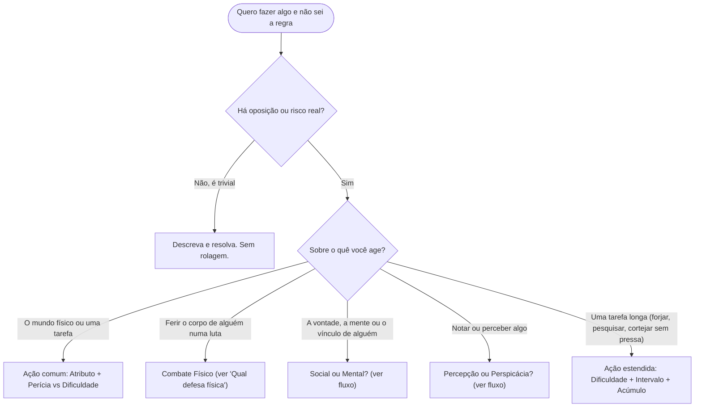
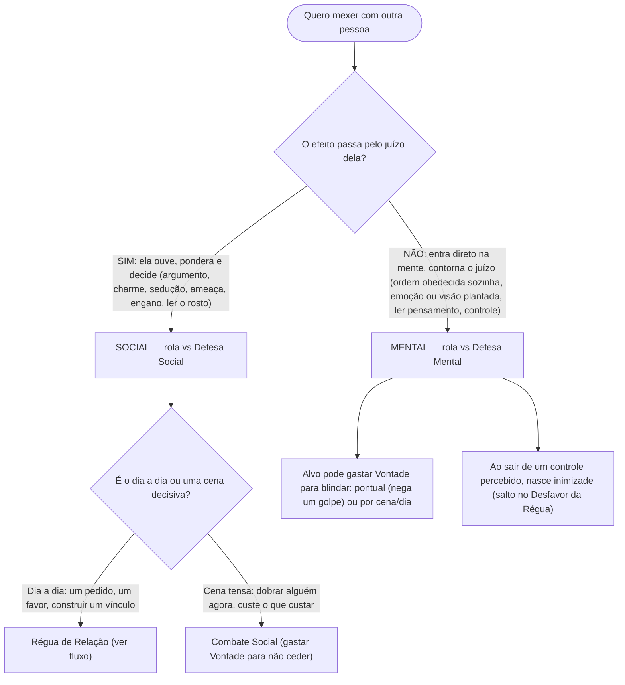
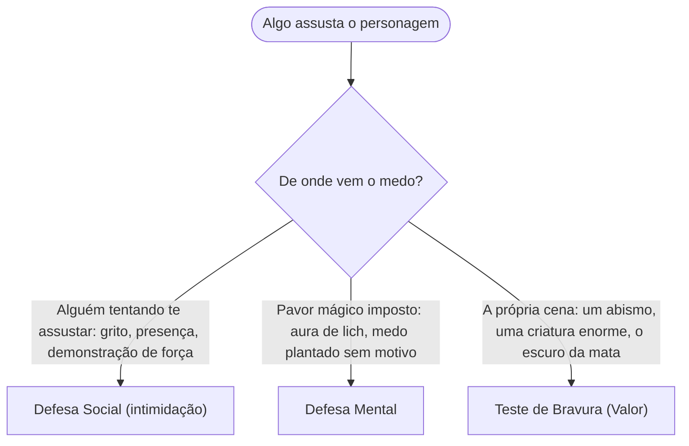
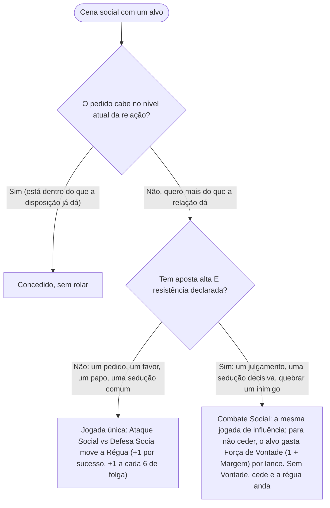
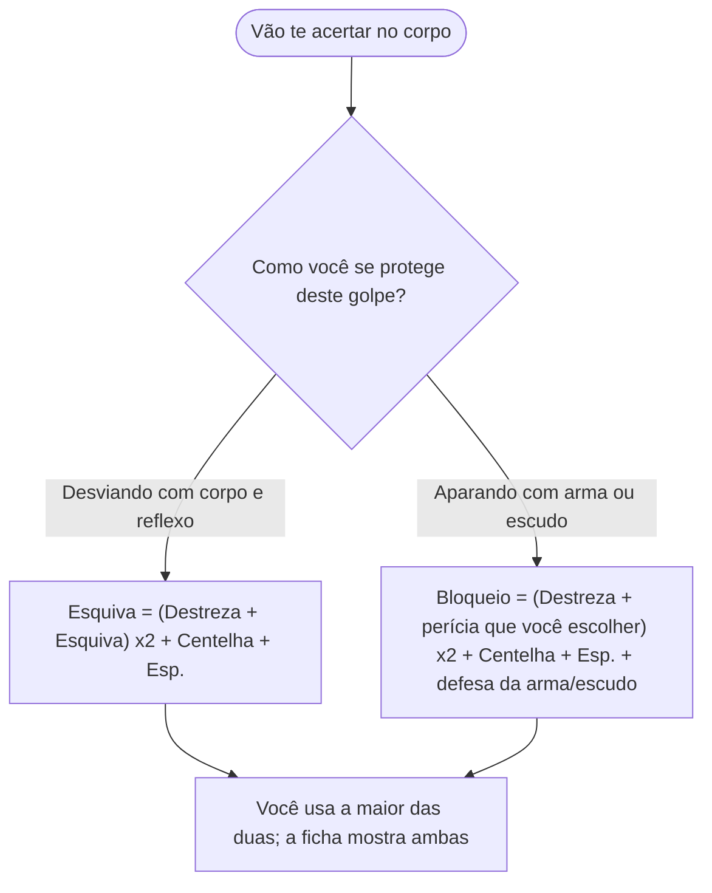
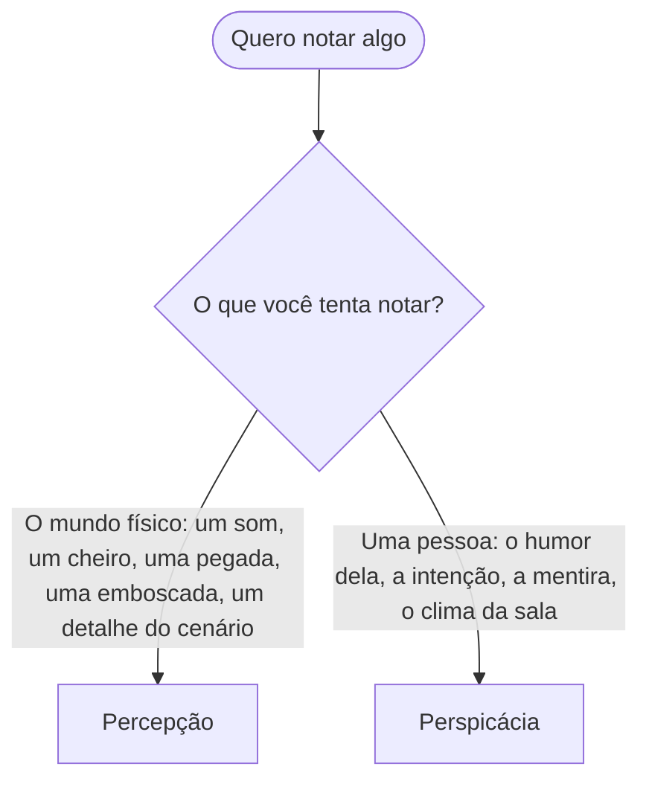

# Qual sistema eu uso? (fluxogramas de roteamento)

O Centelha tem muitos subsistemas, e o novato quase nunca trava na **regra**: trava em saber
**qual regra** aplicar. Esta página é um mapa de bolso. Comece pelo fluxo grande e, na dúvida de
uma bifurcação específica, veja o fluxo dela embaixo.

Regra zero, antes de tudo: **rola-se dado só quando há oposição ou risco real.** Se a coisa é
trivial e ninguém resiste, descreva e siga. Se um pedido cabe no nível da relação, é de graça
(ver Régua). O dado entra quando o resultado é incerto e importa.

---

## O grande roteador

---

## Social ou Mental? (o teste do "como")

A pergunta não é se a coisa é mágica. É **por onde ela age**.

Atalho: **Social = você não quer ceder. Mental = tentam tirar de você a escolha de ceder.**

---

## Os três medos

Medo é o caso que mais confunde, então tem régua própria.

---

## Régua de Relação ou Combate Social?

A Régua é o **default** do social. O Combate Social é a exceção, reservado às cenas grandes. Na
dúvida, é Régua. Ele **não** tem PV social nem dano: é a mesma jogada de influência, e resistir é
gastar Força de Vontade.

---

## Qual defesa física? (Esquiva ou Bloqueio)

---

## Percepção ou Perspicácia?

Nomes parecidos, fronteira simples: **o mundo x as pessoas.**

---

## Folha de bolso (sem diagrama)

- **Rola dado?** Só com oposição ou risco. Trivial, não. Pedido dentro do nível da relação, não.
- **Ação comum:** Atributo + Perícia vs Dificuldade (5 fácil / 10 média / 15 difícil / 20 limite
  humano). Supera o alvo = sucesso; cada 6 acima = +1 Margem.
- **Social x Mental:** passa pelo juízo = Social; contorna o juízo = Mental.
- **Régua x Combate Social:** dia a dia = Régua (jogada única); cena tensa = Combate Social
  (gastar Força de Vontade, 1 + Margem, para não ceder). Sem PV social nem dano.
- **Três medos:** intimidação = Social; medo mágico = Mental; medo da cena = Bravura (Valor).
- **Defesa física:** desviou = Esquiva; aparou = Bloqueio (usa a maior).
- **Percepção x Perspicácia:** o mundo = Percepção; as pessoas = Perspicácia.
- **Blindar a mente:** gastar Força de Vontade (pontual ou por cena/dia). Contra **leitura** não
  dá para se recusar: só o número da Defesa protege.

---

## Para futuras alterações

- **Reescala D6 (0–6 e 0–12):** em andamento. Plano de execução, mapa antes/depois e a lista de
  implementações futuras (Proezas/Feitiçarias do tier Desperto, re-ancoragem das dificuldades,
  migração do bestiário) estão em `Reescala.md`. Quando as escalas mudarem, os números citados
  neste fluxograma (Dificuldade 5/10/15/20, Defesa ×2, etc.) precisam ser revisados por lá.
- **Combate Social:** a versão canônica é a simplificada do site (`relacoes-sociais.md`), sem
  Firmeza/PV social. O doc de trabalho antigo `Combate_Social.md` (com Firmeza/canais) está
  **obsoleto**; não usar.
